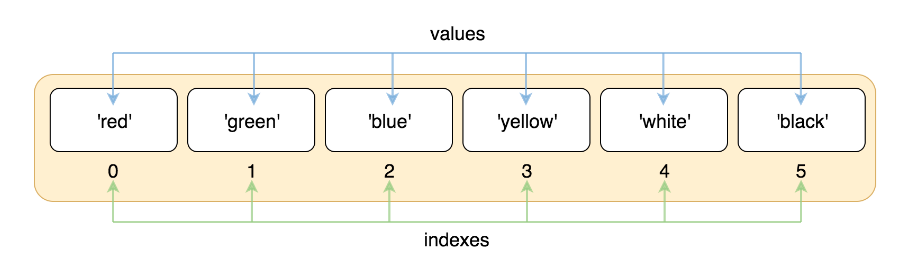
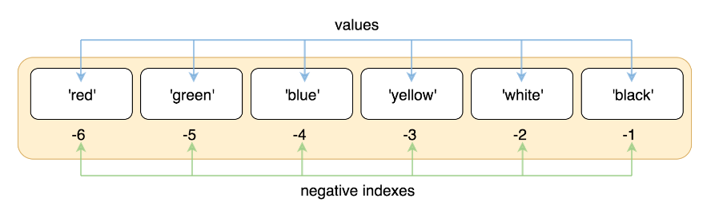

[Great Blog](https://railsware.com/blog/python-for-machine-learning-indexing-and-slicing-for-lists-tuples-strings-and-other-sequential-types/)

```python

colors = ['red', 'green', 'blue', 'yellow', 'white', 'black']

```



### Negative indexes

What if we want to take the last element of a list? Or the penultimate element? In this case, we want to enumerate elements from the tail of a list.

To address this requirement there is negative indexing. So, instead of using indexes from zero and above, we can use indexes from -1 and below.


