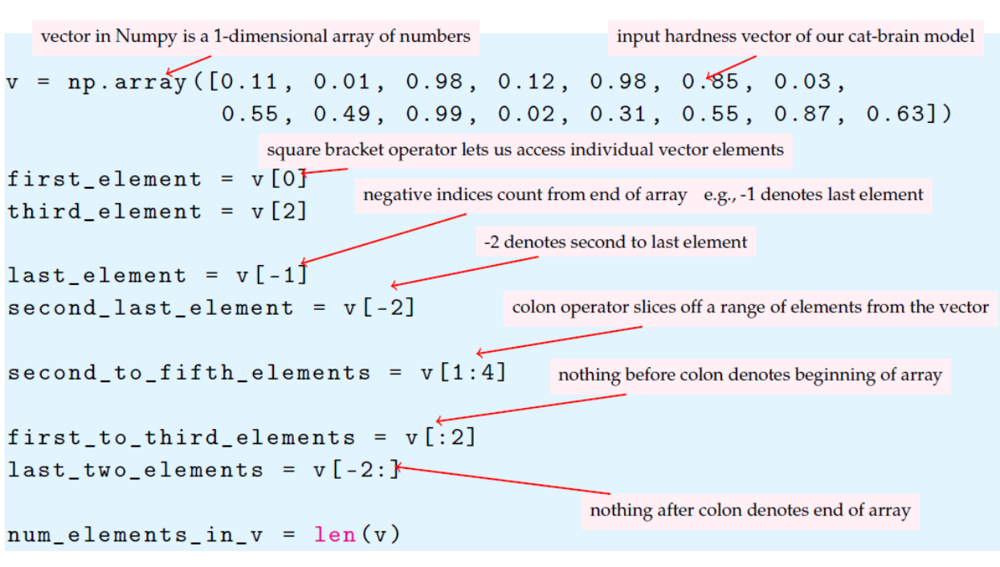

[Great Blog](https://railsware.com/blog/python-for-machine-learning-indexing-and-slicing-for-lists-tuples-strings-and-other-sequential-types/)


```py

nums = [10, 20, 30, 40, 50, 60, 70, 80, 90]
some_nums = nums[2:7]
# some_nums
# [30, 40, 50, 60, 70]

```

#### From Book - Math and Architectures of Deep Learning -2021-USD-32

