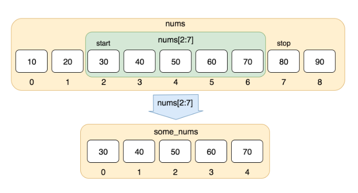

### Key slice syntax

 **x[start:end:step]** is the full form,

Here we can  omit to use a default value: start defaults to 0 , end defaults to the length of the list, and step defaults to 1.

And hence x[:] means same as x[0 : len(x) : 1]

---



https://railsware.com/blog/python-for-machine-learning-indexing-and-slicing-for-lists-tuples-strings-and-other-sequential-types/

---

### Taking n first elements of a list

```python
nums = [10, 20, 30, 40, 50, 60, 70, 80, 90]
nums[:5]

# [10, 20, 30, 40, 50]

```

### Taking n last elements of a list

```python
nums = [10, 20, 30, 40, 50, 60, 70, 80, 90]
nums[-3:]
# [70, 80, 90]
```
---

###  The double colon ::

The extended slicing notation string[start:stop:step] uses three arguments start, stop, and step to carve out a subsequence. It accesses every step-th element between indices start (included) and stop (excluded).

#### The double colon :: occurs if you drop the stop argument. In this case, Python will use the default value and doesn’t assume an artificial stop.

Here are some examples:

- string[::2] reads “default start index, default stop index, step size is two—take every second element”. So it means, it means 'nothing for the first argument, nothing for the second, and jump by 2.

- string[::3] reads “default start index, default stop index, step size is three—take every third element”.

- string[::4] reads “default start index, default stop index, step size is four—take every fourth element“.

- string[2::2] reads “start index of two, default stop index, step size is two—take every second element starting from index 2“.


---

### `a[::-1]` is a shortcut for reversing the list.

Referring to the [cpython source code](https://hg.python.org/cpython/file/3d4d52e47431/Objects/sliceobject.c#l132), we we can see the actual rules.

 1. If the step is not given, it is equal to 1

 2. If a start value is not given, choose a default start as 0 if step is not negative, or length -1 if it is

 3. If an end value is not given, choose a default end as length if step is not negative or -1 if it is (these values allow the last element to be kept knowing that the end point is non-inclusive)


Applying these rules we get

 - `a[::-1]` uses start of length-1 (default), an end of -1 (default), and step of -1

- `a[:0:-1]` uses a start of length-1 (default), an end of 0, and a step of -1

- `a[:2:-1]` uses a start of length-1 (default), an end of 2, and a step of -1

- `a[0:-1]` uses a start of 0, an end of length-1 (modified), and a step of 1 (default)

https://stackoverflow.com/a/35975751/1902852

###  negative strides besides -1 useful? Consider the following examples:


```py

x = ['a', 'b', 'c', 'd', 'e', 'f', 'g', 'h']

x[::2]  # ['a', 'c', 'e', 'g']
x[::-2] # ['h', 'f', 'd', 'b']

```

Read - Effective_Python_90_Specific_Ways_to_Write_Better_PythonRs_3581LOOKS_GREAT_for_BEST_PRACTICE  - P-43

---


https://stackoverflow.com/a/4012395/1902852

`:` is the delimiter of the slice syntax to 'slice out' sub-parts in sequences , `[start:end]`

    [1:5] is equivalent to "from 1 to 5" (5 not included)
    [1:] is equivalent to "1 to end"
    [len(a):] is equivalent to "from length of a to end"

    Remember that [1:5] starts with the object at index 1, and the object at index 5 is not included.

---

what does the 3 mean in somesequence[::3]?

As we know, the third parameter is the step. So, it means 'nothing for the first argument, nothing for the second, and jump by three'. It gets every third item of the sequence sliced.

[::3] just means that you have not specified any start or end indices for your slice. Since you have specified a step, 3, this will take every third entry of something starting at the first index. For example:

```python
'123123123'[::3]
# '111'
```

---

https://stackoverflow.com/a/509295/1902852

    a[start:stop]  # items start through stop-1
    a[start:]      # items start through the rest of the array
    a[:stop]       # items from the beginning through stop-1
    a[:]           # a copy of the whole array

There is also the `step` value, which can be used with any of the above:

    a[start:stop:step] # start through not past stop, by step

The key point to remember is that the `:stop` value represents the first value that is _not_ in the selected slice. So, the difference between `stop` and `start` is the number of elements selected (if `step` is 1, the default).

The other feature is that `start` or `stop` may be a _negative_ number, which means it counts from the end of the array instead of the beginning. So:

    a[-1]    # last item in the array
    a[-2:]   # last two items in the array
    a[:-2]   # everything except the last two items

Similarly, `step` may be a negative number:

    a[::-1]    # all items in the array, reversed
    a[1::-1]   # the first two items, reversed
    a[:-3:-1]  # the last two items, reversed
    a[-3::-1]  # everything except the last two items, reversed

Python is kind to the programmer if there are fewer items than you ask for. For example, if you ask for `a[:-2]` and `a` only contains one element, you get an empty list instead of an error. Sometimes you would prefer the error, so you have to be aware that this may happen.

### Relation to `slice()` object

The slicing operator `[]` is actually being used in the above code with a `slice()` object using the `:` notation (which is only valid within `[]`), i.e.:

    a[start:stop:step]

is equivalent to:

    a[slice(start, stop, step)]

Slice objects also behave slightly differently depending on the number of arguments, similarly to `range()`, i.e. both `slice(stop)` and `slice(start, stop[, step])` are supported.
To skip specifying a given argument, one might use `None`, so that e.g. `a[start:]` is equivalent to `a[slice(start, None)]` or `a[::-1]` is equivalent to `a[slice(None, None, -1)]`.

While the `:`-based notation is very helpful for simple slicing, the explicit use of `slice()` objects simplifies the programmatic generation of slicing.

---
