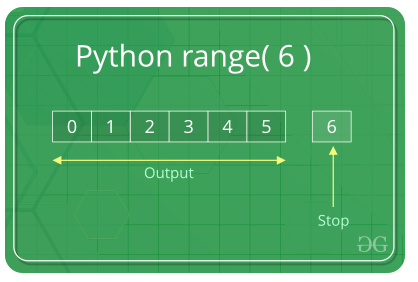
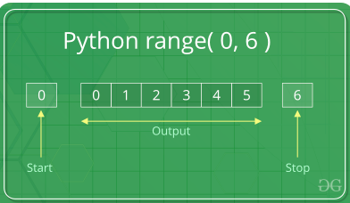
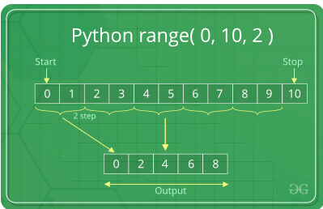

https://www.geeksforgeeks.org/python-range-function/

#### range(stop) takes one argument.

#### range(start, stop) takes two arguments.

#### range(start, stop, step) takes three arguments.

---

## range(stop)

When user call range() with one argument, user will get a series of numbers that starts at 0 and includes every whole number up to, but not including, the number that user have provided as the stop. For Example –



---

## range(start, stop)

When user call range() with two arguments, user get to decide not only where the series of numbers stops but also where it starts, so user don’t have to start at 0 all the time. User can use range() to generate a series of numbers from X to Y using a range(X, Y). For Example -arguments



---

### range(start, stop, step)

When user call range() with three arguments, user can choose not only where the series of numbers will start and stop but also how big the difference will be between one number and the next. If user don’t provide a step, then range() will automatically behave as if the step is 1.

```python
for i in range(0, 10, 2):
    print(i, end = " ")

# 0 2 4 6 8
```


