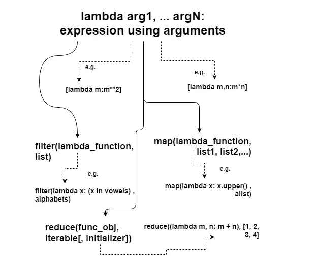

### [What is lambda in Python?](https://www.techbeamers.com/python-lambda/#what)

Lambda is an unnamed function. It provides an expression form that generates function objects.

This expression form creates a function and returns its object for calling it later.



### How to create a lambda function?

It has the following signature:

```
lambda arg1, arg2, ... argN: expression using arguments

```

The body of a lambda function is akin to what you put in a def body’s return statement. The difference here is that the result is a typed-expression, instead of explicitly returning it.

Please note that a lambda function can’t include any statements. It only returns a function object which you can assign to any variable.

The lambda statement can appear in places where the def is not allowed. For example – inside a list literal or a function call’s arguments, etc.

### Example

lambda inside a list :

```
mylist = lambda m : m**2

print(mylist(10))
#100

mylist_2 = lambda m,n: m * n
print(mylist_2(2,3))
# 6

# Now return a list (i.e. within square-bracket)
alist = [lambda m:m**2, lambda m,n:m*n, lambda m:m**4]

print(alist[0](10), alist[1](2, 20), alist[2](3)) # Output: 100 40 81

```
